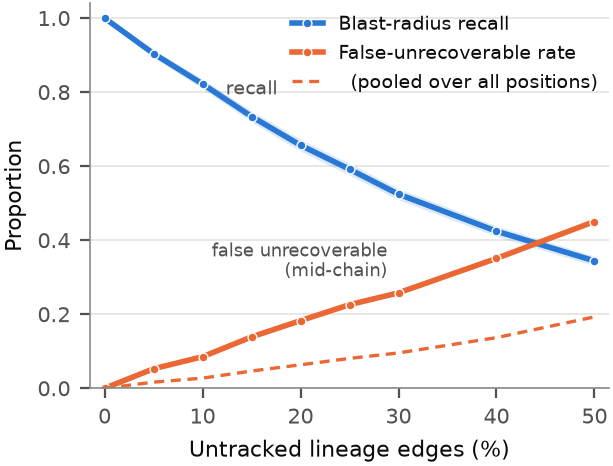
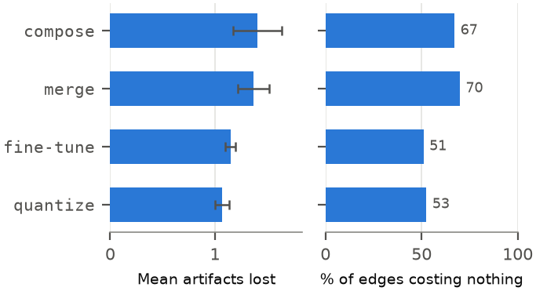

# Blast Radius and Recovery for Compromised AI Model Lineage

**License:** Apache-2.0 · **Status:** research prototype · **Reproduces in ~13s**

Reference implementation for the paper *Beyond Detection: A Recovery-Oriented
Architecture for Compromised AI Model Remediation* (preprint in preparation).

Existing AI supply chain tooling verifies a model artifact at the moment you
adopt it. Signing answers *"is this artifact what it claims to be."* It does not
answer *"what else is affected, and what do I do about it."* Signed provenance
formats can carry derivation relationships, and SLSA and in-toto already do;
what verification at adoption time does not provide is the collection, the
index, or any account of the answer's quality when the record is incomplete.

This prototype addresses what happens afterwards: when a model or dataset is
discovered to be compromised months later, which downstream models are affected,
and what can actually be done about each one.

> **Motivating case.** In December 2023 the Stanford Internet Observatory found
> validated CSAM in LAION-5B and recommended that Stable Diffusion 1.5 models
> without safety measures applied be deprecated and their distribution ceased
> where feasible. Acting on that was largely impractical: curated efforts such as
> Ecosystem Graphs do link assets across organisations, but at organisation and
> product granularity rather than by content hash, with no coverage guarantee
> and no recovery planning. The query was never the hard part.
## What it does

1. Builds a lineage DAG of model artifacts with typed edges (`fine-tune`, `quantize`, `merge`, `compose`)
2. Computes **blast radius**: everything downstream of a compromised artifact
3. Computes a **recovery plan** per affected model: the nearest clean signed ancestor, the operation chain to rebuild from it, and what that costs
4. Evaluates both against ground truth the queries never see

## The experimental design

Two graphs are generated from the same underlying lineage:

- `data/true_lineage.json` — every relationship that actually happened. Ground truth, used only by the evaluator.
- `data/tracked_lineage.json` — what a real system would have on record. Each true edge independently has a 15% chance of never being recorded, modeling the fact that not every fine-tune submits a signing attestation or manifest.

The queries only ever see the tracked graph. This is what makes the evaluation meaningful: it measures what an operator would actually get, not what a complete-information system could theoretically achieve.

Patient zeros are placed at two structurally different positions: at lineage **roots** (poisoned foundation model or dataset) and **mid-chain** (compromise introduced during one team's fine-tune). These turn out to demand completely different incident responses.

## Results

`evaluate.py` runs a single fully-inspectable case; `sweep.py` runs the
statistical evaluation the claims rest on — 300 trials per condition, 95%
confidence intervals, ~13 seconds end to end.





| Untracked | Recall (95% CI) | False-unrec. count | rate (pooled) | rate (mid-chain) | Unsafe plans |
|---|---|---|---|---|---|
| 0% | 1.000 | 0 | 0.000 | 0.000 | 0 |
| 5% | 0.903 ± 0.011 | 179 | 0.015 | 0.049 | 0 |
| 15% | 0.734 ± 0.015 | 408 | 0.044 | 0.133 | 0 |
| 30% | 0.525 ± 0.015 | 547 | 0.089 | 0.244 | 1 |
| 50% | 0.344 ± 0.013 | 592 | 0.177 | 0.425 | 1 |

### The findings

**Proposed plans essentially never reuse a compromised input.** The dangerous
error is a plan that says "roll back" when executing it would reintroduce the
compromise. Measured by walking each proposed rebuild path against true
dependencies: **zero** occurrences up to 15% unrecorded edges, and one per
condition from 20% to 50%, against populations of 704 to 3,499 recoverable
verdicts.

> An earlier version of this repo reported this error as 3.1%. That number
> compared the tracked planner's verdict against a *full-graph planner's
> independently chosen* plan. The two select targets independently, so
> restoring a hidden edge can send the full-graph planner to a different,
> nearer target that happens to be blocked — which says nothing about whether
> the plan actually proposed is safe. That quantity is now reported separately
> as *verdict disagreement* (2.4% at 15%, 6.4% at 50%), which is what it is.

**A conservative setting makes it provable rather than merely observed.**
`recovery_plan(..., strict=True)` also treats the rebuild path's own parent as
blocking, under which a `recoverable` verdict is provably correct. It costs
precision: 3.2% of its `blocked` verdicts have every off-path parent clean.
Giving the guarantee up admits additional plans: 47 to 97 extra recoverable
verdicts per condition, of which one per condition reused an unrepaired
affected input. Small, but not zero.

**Rollback targets are always safe, under either setting.** Whatever the
planner proposes as a rollback target lies outside the *true* blast radius,
even though the planner only ever sees the incomplete graph. Proved, and zero
violations in every configuration tested.

**The two measures of the falsely-unrecoverable error disagree.** Its *rate*
grows superlinearly in the detection miss rate (fitted log-log exponent 1.30,
bootstrap CI [1.12, 1.51]); its *count* grows **sublinearly** (0.68,
CI [0.52, 0.88]), because the population receiving any verdict collapses from
13,435 to 3,340. Cost is about the count.

**The error is structurally confined.** Root patient zeros supply about
two-thirds of the verdict denominator (70% at p=0, 58% at p=0.50) and cannot
produce this error at all. Not because their descendants lack clean ancestors —
one on another merge branch can make a descendant `blocked` — but because a
`recoverable` verdict would require a target that is an ancestor of the root,
and a root has none. Pooling dilutes the rate roughly threefold.

**Edge cost is zero-inflated, not bimodal.** Every edge type has one mode at
zero and a decreasing tail. Separating the two effects: multi-parent and
composition edges are about *half as likely to cost anything*
(70% and 66% cost nothing, against 51% and 52%) and about
*twice as costly when they do* (mean given nonzero: merge 4.52, compose
4.28, against fine-tune 2.33, quantize 2.24).


> Two corrections here. An earlier version reported merge edges as 2.8x
> *cheaper* to lose — an artifact of a generator in which merges had no
> descendants. And the explanation for why so many edges cost nothing was wrong:
> of 1,014 zero-cost merge deletions, 935 have a parent not exposed to any
> sampled incident at all, and only 79 are alternate-path cases. The ablation
> deletes every edge in the graph, most of which are irrelevant to the sampled
> incidents; that irrelevance, not parent redundancy, is most of the zero mass.

**Strategic missingness breaks the benign model.** An adversary who spends the
recording budget withholding attestations within two hops of patient zero,
rather than losing edges at random, halves recall at an identical budget:
**0.325 vs 0.734**. This assumes an adversary who controls those derivations
(capability 3), not merely one who published a poisoned artifact. It is also
not the optimal strategy, so it is a lower bound on adversarial damage.

**Valid signatures do not mean uncontaminated artifacts.** A signed, unmodified
LoRA adapter is contaminated through the base model it is served against. The
deployed model is base plus adapter; only the adapter was signed.

> Scope: a `compose` node carries one parent, so this model cannot represent a
> deployment as depending on both base and adapter, and cannot represent an
> independently poisoned adapter. Incidents are therefore restricted to
> base-only compromise. An earlier version made an adapter a patient zero and
> emitted plans telling an operator to re-serve the compromised artifact.

## Verifying it

`check_readme.py` sweeps every number in this file against
`results/sweep.json` and fails on anything untraceable. It runs as a
pre-commit hook, because this README twice carried the previous run's numbers
while the code was correct, once in a commit whose message claimed to have
fixed them.

```
./.venv/bin/python check_readme.py
```

## Running it

```
python3 -m venv .venv && ./.venv/bin/pip install -r requirements.txt
./.venv/bin/python generate_dataset.py   # -> data/{true,tracked}_lineage.json
./.venv/bin/python evaluate.py           # worked case -> results/evaluation.json
./.venv/bin/python sweep.py              # statistics  -> results/sweep.json
./.venv/bin/python make_figures.py       # -> figures/*.pdf, *.png, plotted.json
./.venv/bin/python check_readme.py       # every number here, against the results
```

Tested on Python 3.12 with networkx 3.x and matplotlib 3.x, macOS,
September 2026.

### Reproduction

Everything is seeded. `data/*.json`, `results/sweep.json`, and all four figure
files regenerate byte-identically. `results/evaluation.json` differs only in
its `query_time_ms` fields, which are wall-clock measurements; every
substantive value matches.

## Files

| File | Purpose |
|---|---|
| `models.py` | `ModelRecord` schema, operation semantics, rebuild cost model |
| `generate_dataset.py` | Synthetic lineage generator, true vs tracked graphs |
| `lineage_graph.py` | DAG construction and blast radius query |
| `recovery.py` | Recovery planner and ancestor search |
| `evaluate.py` | Single-case evaluation harness for detection and recovery |
| `sweep.py` | Statistical evaluation: drop-rate curve, edge criticality, non-uniform and adversarial missingness, merge-density stress |
| `make_figures.py` | The two figures, from `results/sweep.json` |

## Limitations

Synthetic lineage throughout. No real model registry exposes the ground-truth
graph needed to compute recall, which is why the true-versus-tracked construction
is synthetic by necessity rather than by convenience.

The independence assumption is partially addressed rather than fully resolved:
`sweep.py` shows results hold under four different non-uniform missingness
structures, but all four still drop edges independently. Correlated gaps, where
one team's entire pipeline goes unattested at once, would concentrate loss on
connected subgraphs and are not modelled. Calibrating any of these against real
adoption data remains the main open item.

Graph structure comes from one generative model: branching factor, operation
mix, and the rate at which merges join branches that share an ancestor (0.35 as
a parameter, about 21% realized, since generation-1 merges can only be
cross-family). Nothing here establishes behaviour on a real registry's
topology, and that is the main threat to these results — model hubs publish
enough structure that real topology with synthetic missingness is the
experiment that should replace this one.

Federated learning is handled only at round granularity; per-client attribution
is out of scope.

## Citing

A preprint is in preparation. Until it is posted, please cite this repository:

```
Bhargava, A. Blast Radius and Recovery for Compromised AI Model Lineage.
https://github.com/apoorve1577/model-lineage-recovery
```

## License

Apache License 2.0. See `LICENSE`.
